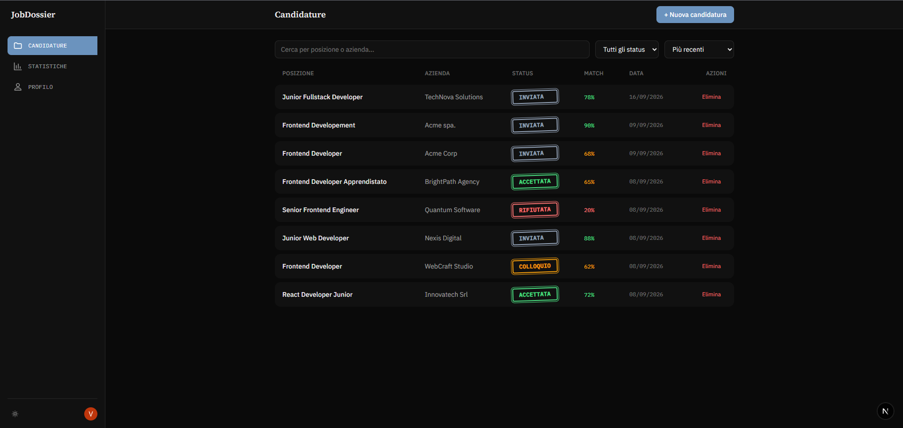
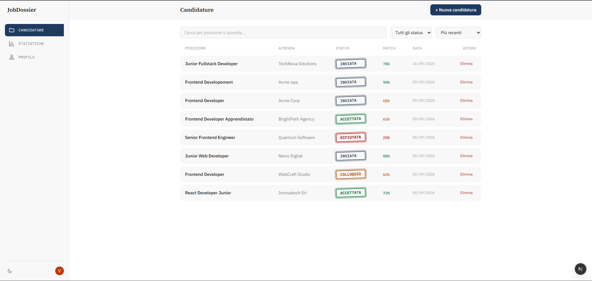
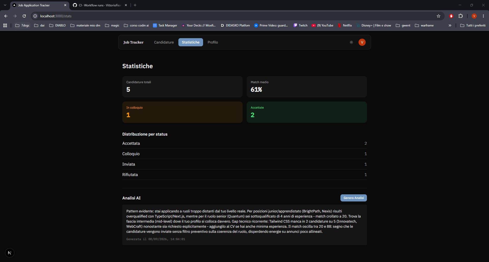
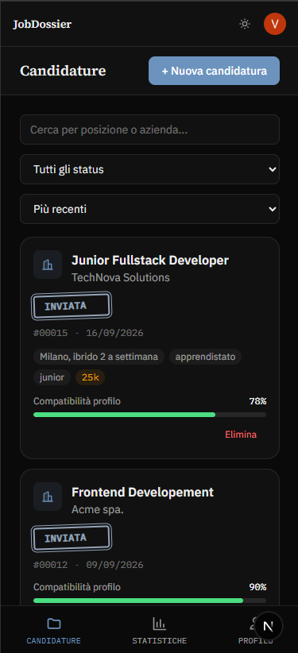

# Job Application Tracker


A job application tracker with AI-powered CV matching and insights, built with Next.js, Prisma, and Clerk. Each application is treated as an archival case file — the UI ("Dossier") borrows visual language from paper records: ink stamps for status, reference numbers, serif headings.

**Live demo:** [job-application-tracker-omega-red.vercel.app](https://job-application-tracker-omega-red.vercel.app)

## Features

- Track job applications (company, position, job description, status)
- AI-powered CV match scoring against each job description, with concrete suggestions (Claude)
- AI-generated insights across all applications (patterns, gaps, strategic advice)
- Stats dashboard (totals, average match, status breakdown)
- Auth via Clerk
- Full light/dark theme support with a manual toggle
- Responsive, mobile-friendly UI

## Screenshots






## Tech stack

- [Next.js 16](https://nextjs.org) (App Router, Turbopack)
- [Prisma](https://www.prisma.io) + PostgreSQL
- [Clerk](https://clerk.com) for authentication
- [Anthropic API](https://www.anthropic.com) (Claude) for CV matching and insights
- Tailwind CSS v4 (token-based design system)
- TypeScript

## Getting started

### Prerequisites

- Node.js 20+
- Docker (for local Postgres) or an external Postgres instance
- A [Clerk](https://dashboard.clerk.com) account (free tier works) for auth keys
- An [Anthropic API key](https://console.anthropic.com)

### Setup

1. Clone the repo and install dependencies:

   ```bash
   git clone https://github.com/VittorioFiorita/job-application-tracker.git
   cd job-application-tracker
   npm install
   ```

2. Copy `.env.example` to `.env.local` and fill in your Clerk/Anthropic keys:

   ```bash
   cp .env.example .env.local
   ```

3. Start the local database:

   ```bash
   docker compose up -d
   ```

4. Run the Prisma migrations:

   ```bash
   npx prisma migrate dev
   ```

5. Start the dev server:

   ```bash
   npm run dev
   ```

   Open [http://localhost:3000](http://localhost:3000).

### Environment variables

| Variable | Description |
|---|---|
| `DATABASE_URL` | PostgreSQL connection string |
| `NEXT_PUBLIC_CLERK_PUBLISHABLE_KEY` | Clerk publishable key |
| `CLERK_SECRET_KEY` | Clerk secret key |
| `ANTHROPIC_API_KEY` | Anthropic API key, used for CV matching and insights |

## Available scripts

| Command | Description |
|---|---|
| `npm run dev` | Start the dev server (Turbopack) |
| `npm run build` | Production build |
| `npm run start` | Start the production server |
| `npm run lint` | Run ESLint |

## CI

Every push/PR to `main` runs lint, typecheck, and build via GitHub Actions ([workflow](.github/workflows/ci.yml)).
